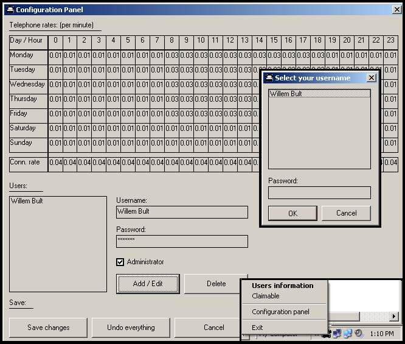

<div align="center">

## CostTracker


</div>

### Description

With this program you can keep track of your internetcosts when you use a dial-up connection. This program also has the ability to distinguish the costs of multiple users.

My parents made me write this so they can tell how much I, and how much my brother spent by surfing on the internet.

A nice feature is that it's possible to start claimable sessions. For example, if I am on the internet, doing something for school, I start a claimable session because I can claim the costs of that session at my parents.

PLEASE VOTE FOR THIS CODE!!!
 
### More Info
 
The telephone provider's connection rates. And the users and passwords.

In the previous version there was a bug with a flashing form, which appeared when you were using a non dial-up connection. The program now only checks for modem (dial-up) connections, so there shouldn't be any flashing forms any more.

By the way, PLEASE VOTE FOR MY CODE!!!

The amount of money the different users have spent by surfing on the internet, divided by months.


<span>             |<span>
---                |---
**Submitted On**   |2003-01-03 11:50:26
**By**             |[Willem Bult](https://github.com/Planet-Source-Code/PSCIndex/blob/master/ByAuthor/willem-bult.md)
**Level**          |Intermediate
**User Rating**    |5.0 (15 globes from 3 users)
**Compatibility**  |VB 4\.0 \(32\-bit\), VB 5\.0, VB 6\.0
**Category**       |[Complete Applications](https://github.com/Planet-Source-Code/PSCIndex/blob/master/ByCategory/complete-applications__1-27.md)
**World**          |[Visual Basic](https://github.com/Planet-Source-Code/PSCIndex/blob/master/ByWorld/visual-basic.md)
**Archive File**   |[CostTracke152350132003\.zip](https://github.com/Planet-Source-Code/willem-bult-costtracker__1-42140/archive/master.zip)

### API Declarations

```
InternetGetConnectedState Lib "wininet"
InternetAutodialHangup Lib "wininet.dll"
Shell_NotifyIcon Lib "shell32"
```


